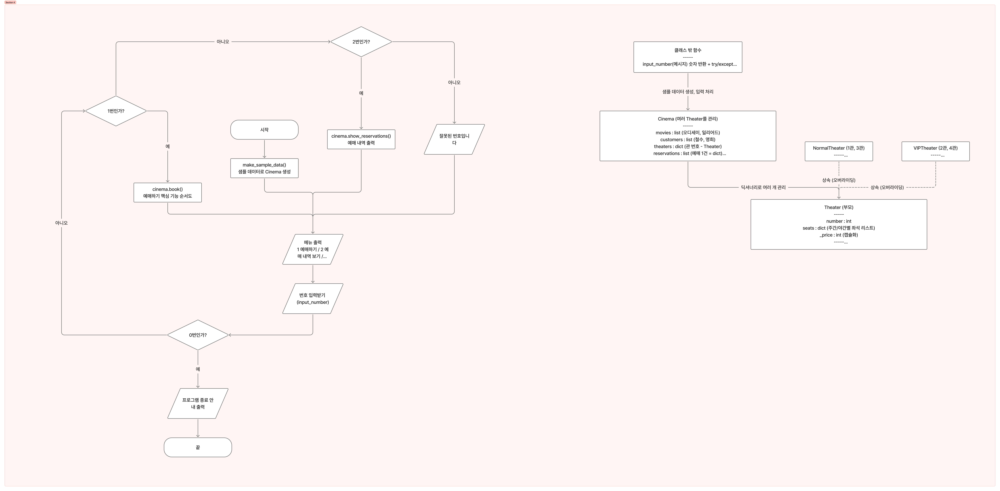

# 영화관 예매 프로그램

콘솔에서 동작하는 영화관 좌석 예매 프로그램입니다.
클래스 상속, 메서드 오버라이딩, 캡슐화를 연습하기 위한 팀 프로젝트입니다.

## 실행 방법

Python 3.14와 [uv](https://docs.astral.sh/uv/)가 필요합니다.

```bash
uv sync                      # 의존성 설치
uv run python src/hyjun.py   # 프로그램 실행
```

## 사용 방법

프로그램을 실행하면 샘플 데이터가 들어간 영화관이 만들어지고 메뉴가 나옵니다.

```
===== 영화관 메뉴 =====
1. 예매하기
2. 예매 내역 보기
0. 종료
```

**예매하기**는 아래 순서로 진행됩니다. 모든 선택은 번호로 입력합니다.

1. 관객 선택 (철수, 영희)
2. 영화 선택 (오디세이, 일리아드)
3. 상영시간 선택 (주간, 야간)
4. 상영관 선택 (일반관, VIP관)
5. 좌석 배치도를 보고 좌석 번호 입력
6. 예약 확인 (예 / 아니오)

종료하면 영화 수, 상영관 수, 예매 건수, 총매출이 출력됩니다.

## 샘플 데이터

| 상영관 | 종류 | 영화 | 가격 |
| --- | --- | --- | --- |
| 1관 | 일반 | 오디세이 | 10,000원 |
| 2관 | VIP | 오디세이 | 15,000원 |
| 3관 | 일반 | 일리아드 | 10,000원 |
| 4관 | VIP | 일리아드 | 15,000원 |

- 상영관마다 주간/야간 각각 좌석 4개가 있습니다.
- 시연용으로 1관 주간 2번 좌석이 영희 이름으로 미리 예약되어 있습니다.

## 구조



| 클래스 | 역할 |
| --- | --- |
| `Theater` | 상영관(부모). 주간/야간 좌석, 가격(`_price`, 캡슐화), 좌석 예약 기능 |
| `NormalTheater` | 일반관. 기본 가격 그대로 |
| `VIPTheater` | VIP관. `get_price()`를 오버라이딩해서 기본 가격 + 5,000원 |
| `Cinema` | 영화, 관객, 상영관, 예매 내역을 관리하고 예매 흐름을 진행 |

클래스 밖 함수로는 숫자 입력 검사(`input_number`), 목록 선택(`choose_item`),
가격 표시(`format_price`), 메뉴 출력(`get_menu_choice`), 샘플 데이터 생성(`make_sample_data`)이 있습니다.

## 파일 구성

```
src/
├── hyjun.py                # 영화관 예매 프로그램 (메인)
├── main.py                 # 클래스 설계 초안
└── hyper_project/
    └── __init__.py         # uv 패키지 기본 진입점
docs/
└── image1.png              # 순서도 및 클래스 다이어그램
```

## 코드 검사

[Ruff](https://docs.astral.sh/ruff/)로 린트 규칙이 설정되어 있습니다 (`pyproject.toml` 참고).

```bash
uv run ruff check src
```
